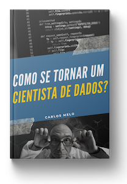

    
    
    

# Sigmoidal

  

Aqui você encontra os *notebooks* e códigos Python do blog Sigmoidal. Cada arquivo deste repositório é parte de um artigo do site. Para conseguir absorver o máximo possível, recomendo você ler também os *posts* do site, para maiores detalhes.

**Sigmoidal:** http://sigmoidal.ai

## Notebooks:
Veja os tutoriais publicados do Sigmoidal:

**Como usar o Histograma para Data Science:** https://bit.ly/2L2cMwy

**Como Implementar Regressão Linear com Python:** https://bit.ly/2Li5pzY

**Data Science: Investigando o naufrágio do Titanic:** https://bit.ly/2Ubr5SH

**Como Tratar Dados Ausentes com Pandas:** https://bit.ly/31KWSMN

**XGBoost: aprenda este algoritmo de Machine Learning em Python:** https://bit.ly/2UbRhws

## Códigos
*(Não são notebooks, mas códigos Python de apoio para artigos específicos do Sigmoidal)*

**Redes Neurais Multicamadas com Python e Keras:** https://bit.ly/2UcD0j3

### Sobre o blog:

**Foco:** Python, Data Science, Deep Learning e Espaço

O Sigmoidal foi uma iniciativa pessoal para divulgar e tornar mais acessível conteúdos da área de Inteligência Artificial e Python. Tenho me comprometido 100% para trazer artigos de altíssimo nível, para ajudar tanto aqueles que estão começando na carreira quando aqueles que buscam informações mais avançadas e fora da caixa.

### Sobre mim:

Sou Piloto Militar da Força Aérea Brasileira e Engenheiro de Missão de Satélite no Centro de Operações Espaciais (COPE), em Brasília-DF. Dentro da área de Data Science, tenho desenvolvido projetos de reconhecimento de alvos a partir de imagens de satélites, também dentro do COPE.

* Graduação em Ciências Aeronáuticas pela AFA.
* Mestrado em Ciências e Tecnologias Espaciais pelo ITA.
* MBA em Gestão de Projetos e Processos pela UNIFA.
* Curso de Operações Espaciais pela Força Aérea do Canadá.

### eBook:
Se você quer saber mais sobre a carreira em Data Science, os salários de cientistas de dados, qual linguagem de programação aprender ou por onde começar a estudar, baixe meu eBook gratuitamente. 

**Como se Tornar um Cientista de Dados:** https://bit.ly/2MJTkaa

---

